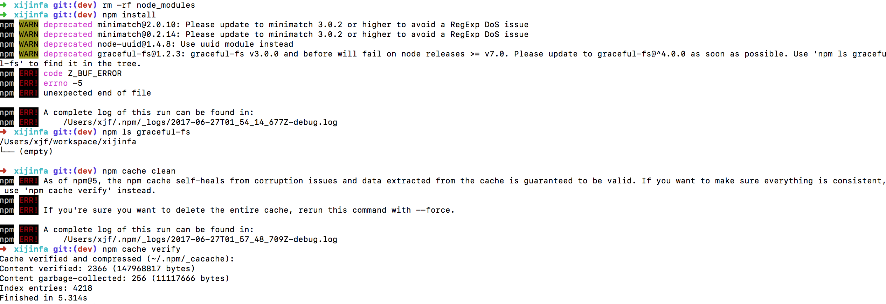

#About NPM install ERROR:  'code Z_BUF_ERROR npm ERR! errno -5'

I've met some problems when deploying my work project on new mac.

After using 'npm cache clean --force' && then run 'npm install', problem solved.

Ref:[npm install appium failed:errno -5,unexpected end of file](https://github.com/npm/npm/issues/14394)

